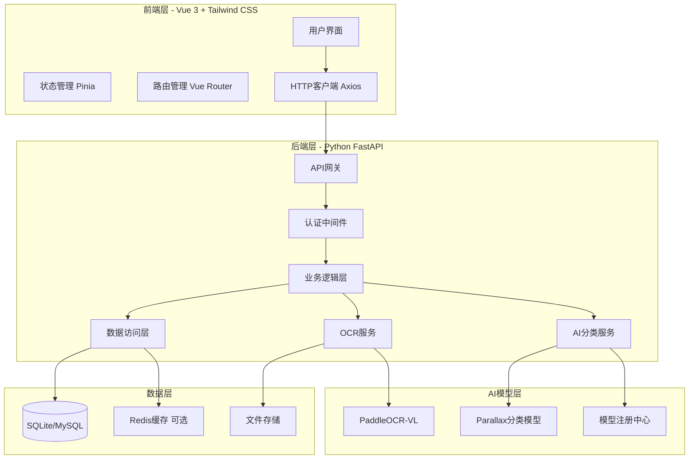

# 设计文档

## 概述

手写管理助手是一个跨端应用，采用前后端分离架构。前端使用Vue 3和Tailwind CSS构建响应式用户界面，后端使用Python FastAPI框架提供RESTful API服务。系统核心功能包括OCR文字识别、AI智能分类和跨端数据同步。

系统工作流程：
1. 用户通过前端上传图片、拍照或直接输入文本
2. 后端OCR引擎（PaddleOCR-VL）识别图片中的文字
3. AI分类器（基于Parallax部署）自动判断内容类型（日程/备忘录）
4. 后端提取结构化信息并存储到数据库
5. 前端展示分类后的内容，支持搜索和筛选

## 架构

### 系统架构图



### 数据库选择

系统支持灵活的数据库配置：

**SQLite（推荐用于开发和个人部署）：**
- 零配置，单文件数据库
- 适合中小规模数据（<100GB）
- 跨平台，易于备份和迁移
- 非常适合个人文本归档应用

**MySQL（可选用于生产环境）：**
- 适合多用户、高并发场景
- 成熟的生态系统
- 更好的性能监控工具
- 适合团队或商业部署

通过SQLAlchemy ORM，可以轻松在不同数据库之间切换，只需修改配置文件。

### 技术栈

前端：
- Vue 3 (Composition API)
- Tailwind CSS
- Pinia (状态管理)
- Vue Router
- Axios
- Vite (构建工具)

后端：
- Python 3.10+
- FastAPI
- SQLAlchemy (ORM)
- Alembic (数据库迁移)
- PaddleOCR
- Redis (可选，用于缓存)
- SQLite (开发和小规模部署) / MySQL (生产环境可选)

## 组件和接口

### 前端组件

#### 1. 输入组件 (InputComponent)
负责处理用户输入、图片上传和拍照功能

接口：
```typescript
interface InputComponentProps {
  onTextSubmit: (text: string) => Promise<void>
  onImageSubmit: (file: File) => Promise<void>
  onCameraCapture: (blob: Blob) => Promise<void>
}
```

#### 2. OCR预览组件 (OCRPreviewComponent)
显示OCR识别结果并允许用户编辑

接口：
```typescript
interface OCRPreviewProps {
  recognizedText: string
  onEdit: (editedText: string) => void
  onConfirm: (finalText: string) => Promise<void>
}
```

#### 3. 分类选择组件 (ClassificationComponent)
当AI无法确定分类时，让用户手动选择

接口：
```typescript
interface ClassificationProps {
  suggestedType: 'schedule' | 'memo' | 'unknown'
  onSelect: (type: 'schedule' | 'memo') => Promise<void>
}
```

#### 4. 日程列表组件 (ScheduleListComponent)
展示日程项列表

接口：
```typescript
interface ScheduleListProps {
  schedules: ScheduleItem[]
  dateRange?: { start: Date, end: Date }
  onFilter: (range: { start: Date, end: Date }) => void
}
```

#### 5. 备忘录列表组件 (MemoListComponent)
展示备忘录列表

接口：
```typescript
interface MemoListProps {
  memos: Memo[]
  selectedTags?: string[]
  onTagFilter: (tags: string[]) => void
}
```

#### 6. 搜索组件 (SearchComponent)
提供全局搜索功能

接口：
```typescript
interface SearchProps {
  searchMode: 'fuzzy' | 'exact'
  onSearch: (query: string, mode: 'fuzzy' | 'exact') => Promise<SearchResult[]>
}
```

### 后端API接口

#### 1. 认证接口

```python
POST /api/auth/register
Request: { username: str, password: str, email: str }
Response: { user_id: str, token: str }

POST /api/auth/login
Request: { username: str, password: str }
Response: { user_id: str, token: str, expires_at: datetime }

POST /api/auth/logout
Headers: { Authorization: "Bearer <token>" }
Response: { success: bool }
```

#### 2. OCR接口

```python
POST /api/ocr/recognize
Headers: { Authorization: "Bearer <token>" }
Request: multipart/form-data { image: File }
Response: { 
  text: str, 
  confidence: float,
  language: str,
  processing_time: float
}
```

#### 3. 分类接口

```python
POST /api/classify
Headers: { Authorization: "Bearer <token>" }
Request: { text: str }
Response: { 
  type: 'schedule' | 'memo',
  confidence: float,
  extracted_data: dict
}
```

#### 4. 日程接口

```python
POST /api/schedules
Headers: { Authorization: "Bearer <token>" }
Request: { 
  date: str,
  time: str,
  description: str,
  original_text: str
}
Response: { schedule_id: str, created_at: datetime }

GET /api/schedules
Headers: { Authorization: "Bearer <token>" }
Query: { start_date?: str, end_date?: str }
Response: { schedules: ScheduleItem[] }

PUT /api/schedules/{schedule_id}
DELETE /api/schedules/{schedule_id}
```

#### 5. 备忘录接口

```python
POST /api/memos
Headers: { Authorization: "Bearer <token>" }
Request: { 
  content: str,
  summary: str,
  tags: str[]
}
Response: { memo_id: str, created_at: datetime }

GET /api/memos
Headers: { Authorization: "Bearer <token>" }
Query: { tags?: str[] }
Response: { memos: Memo[] }

PUT /api/memos/{memo_id}
DELETE /api/memos/{memo_id}
```

#### 6. 搜索接口

```python
GET /api/search
Headers: { Authorization: "Bearer <token>" }
Query: { 
  q: str,
  mode: 'fuzzy' | 'exact',
  type?: 'schedule' | 'memo'
}
Response: { 
  results: SearchResult[],
  total: int
}
```

### 后端服务层

#### OCRService
```python
class OCRService:
    def __init__(self, ocr_engine: PaddleOCR):
        self.ocr_engine = ocr_engine
    
    async def recognize_image(self, image_path: str) -> OCRResult:
        """识别图片中的文字"""
        pass
    
    def validate_image(self, file: UploadFile) -> bool:
        """验证图片格式和大小"""
        pass
```

#### ClassificationService
```python
class ClassificationService:
    def __init__(self, model_registry: ModelRegistry):
        self.model_registry = model_registry
    
    async def classify_text(self, text: str) -> ClassificationResult:
        """分类文本内容"""
        pass
    
    async def extract_schedule_info(self, text: str) -> ScheduleData:
        """从文本中提取日程信息"""
        pass
    
    async def extract_memo_info(self, text: str) -> MemoData:
        """从文本中提取备忘录信息"""
        pass
```

#### ModelRegistry
```python
class ModelRegistry:
    def __init__(self):
        self.models = {}
    
    def register_model(self, name: str, model: Any, config: dict):
        """注册新模型"""
        pass
    
    def get_model(self, task_type: str) -> Any:
        """根据任务类型获取模型"""
        pass
    
    async def call_with_fallback(self, task_type: str, *args, **kwargs):
        """调用模型，失败时使用备用模型"""
        pass
```

## 数据模型

### User (用户)
```python
class User:
    id: UUID
    username: str
    email: str
    password_hash: str
    created_at: datetime
    updated_at: datetime
```

### ScheduleItem (日程项)
```python
class ScheduleItem:
    id: UUID
    user_id: UUID
    date: date
    time: time
    description: str
    original_text: str
    created_at: datetime
    updated_at: datetime
```

### Memo (备忘录)
```python
class Memo:
    id: UUID
    user_id: UUID
    content: str
    summary: str
    tags: List[str]
    created_at: datetime
    updated_at: datetime
```

### OCRResult (OCR结果)
```python
class OCRResult:
    text: str
    confidence: float
    language: str
    processing_time: float
```

### ClassificationResult (分类结果)
```python
class ClassificationResult:
    type: Literal['schedule', 'memo']
    confidence: float
    extracted_data: dict
```

### ModelMetrics (模型指标)
```python
class ModelMetrics:
    model_name: str
    call_count: int
    total_response_time: float
    average_response_time: float
    error_count: int
    last_called_at: datetime
```


## 正确性属性

*属性是指在系统所有有效执行中都应该成立的特征或行为——本质上是关于系统应该做什么的形式化陈述。属性是人类可读规范和机器可验证正确性保证之间的桥梁。*

### 属性反思

在编写正确性属性之前，我们需要识别并消除冗余：

- 属性1.1（文件上传传递）和属性1.2（拍照传递）都测试图片传递到OCR引擎，可以合并为一个综合属性
- 属性3.2（日程识别）和属性3.3（备忘录识别）已被属性3.1（分类功能）覆盖
- 属性4.2（日程存储）和属性5.2（备忘录存储）测试相同的存储机制，可以合并
- 属性6.2（立即同步）和属性6.3（显示最新）测试相同的数据一致性，可以合并
- 属性7.3（日程搜索范围）和属性7.4（备忘录搜索范围）可以合并为一个综合搜索属性

### 输入和文件处理属性

Property 1: 图片传递到OCR引擎
*对于任意*有效的图片文件（通过上传或拍照获得），系统应该将该图片正确传递给OCR引擎进行处理
**Validates: Requirements 1.1, 1.2**

Property 2: 文本输入接收
*对于任意*用户输入的文本字符串，系统应该正确接收并处理该文本内容
**Validates: Requirements 1.3**

Property 3: 不支持格式拒绝
*对于任意*不在支持列表中的文件格式，系统应该拒绝该文件并返回支持格式列表的错误信息
**Validates: Requirements 1.4**

Property 4: 支持格式接受
*对于任意*JPG、PNG、JPEG或BMP格式的图片文件，系统应该接受该文件进行处理
**Validates: Requirements 1.6**

### OCR处理属性

Property 5: OCR文本提取
*对于任意*包含可识别文本的图片，OCR引擎应该提取出图片中的文本内容
**Validates: Requirements 2.1**

Property 6: 多语言识别
*对于任意*包含中文和英文的图片，OCR引擎应该同时识别两种语言的文本
**Validates: Requirements 2.2**

Property 7: OCR结果返回
*对于任意*OCR识别操作，后端服务应该将识别结果返回给前端客户端
**Validates: Requirements 2.4**

Property 8: OCR结果可编辑
*对于任意*OCR识别结果，前端客户端应该允许用户编辑该结果
**Validates: Requirements 2.5**

### AI分类属性

Property 9: 文本分类
*对于任意*文本内容，AI分类器应该将其分类为日程项或备忘录
**Validates: Requirements 3.1, 3.2, 3.3**

### 日程管理属性

Property 10: 日程信息提取
*对于任意*被分类为日程的文本，后端服务应该从中提取时间、日期和事件描述信息
**Validates: Requirements 4.1**

Property 11: 归档内容存储完整性
*对于任意*创建的日程项或备忘录，归档存储应该保存所有必需字段（时间、内容、原始文本等），且查询时能完整返回
**Validates: Requirements 4.2, 5.2**

Property 12: 日程时间排序
*对于任意*日程项列表，前端客户端应该按时间顺序（从早到晚）显示
**Validates: Requirements 4.3**

Property 13: 日期范围筛选
*对于任意*日期范围查询，系统应该只返回该范围内的日程项
**Validates: Requirements 4.5**

### 备忘录管理属性

Property 14: 备忘录信息提取
*对于任意*被分类为备忘录的文本，后端服务应该提取创建时间和内容摘要
**Validates: Requirements 5.1**

Property 15: 备忘录时间倒序
*对于任意*备忘录列表，前端客户端应该按创建时间倒序（最新的在前）显示
**Validates: Requirements 5.3**

Property 16: 备忘录标签保存
*对于任意*带有标签的备忘录，系统应该正确保存这些标签，且查询时能返回
**Validates: Requirements 5.4**

Property 17: 标签筛选
*对于任意*标签筛选查询，系统应该只返回包含指定标签的备忘录
**Validates: Requirements 5.5**

### 跨端同步属性

Property 18: 用户数据访问
*对于任意*用户在任意设备上登录，系统应该显示该用户的所有归档内容
**Validates: Requirements 6.1**

Property 19: 数据同步一致性
*对于任意*用户在一个设备上创建或修改的内容，在另一个设备上刷新后应该能看到最新的更改
**Validates: Requirements 6.2, 6.3**

### 搜索功能属性

Property 20: 关键词搜索
*对于任意*包含特定关键词的归档内容，搜索该关键词应该返回这些内容
**Validates: Requirements 7.1**

Property 21: 搜索结果排序
*对于任意*有多个匹配项的搜索，结果应该按相关度排序显示
**Validates: Requirements 7.2**

Property 22: 全字段搜索
*对于任意*搜索查询，系统应该在日程的时间/日期/描述字段和备忘录的摘要/内容/标签字段中搜索
**Validates: Requirements 7.3, 7.4**

Property 23: 搜索模式支持
*对于任意*搜索查询，系统应该支持模糊搜索和精确搜索两种模式，并返回相应的结果
**Validates: Requirements 7.5**

### 模型扩展属性

Property 24: 模型动态注册
*对于任意*通过配置文件添加的新AI模型，系统应该能够加载并使用该模型，无需修改核心代码
**Validates: Requirements 9.2**

Property 25: 任务模型选择
*对于任意*任务类型，当有多个模型可用时，系统应该选择该任务类型对应的正确模型
**Validates: Requirements 9.3**

Property 26: 模型调用监控
*对于任意*AI模型调用，系统应该记录调用次数和响应时间
**Validates: Requirements 9.4**

Property 27: 模型容错切换
*对于任意*AI模型调用失败的情况，系统应该记录错误并尝试使用备用模型
**Validates: Requirements 9.5**

### 安全和隐私属性

Property 28: 密码加密存储
*对于任意*用户注册，系统应该使用加密算法存储密码，数据库中不应存在明文密码
**Validates: Requirements 10.1**

Property 29: 访问权限验证
*对于任意*归档内容访问请求，系统应该验证用户身份和访问权限
**Validates: Requirements 10.2**

Property 30: 数据隔离
*对于任意*用户，该用户只能访问自己创建的归档内容，不能访问其他用户的数据
**Validates: Requirements 10.4**

Property 31: 数据永久删除
*对于任意*用户删除的归档内容，该数据应该从系统中永久删除且无法恢复
**Validates: Requirements 10.5**

## 错误处理

### 错误类型

#### 1. 输入验证错误
- 不支持的文件格式
- 文件大小超限
- 空文本输入
- 无效的日期时间格式

错误响应格式：
```python
{
  "error": "VALIDATION_ERROR",
  "message": "具体错误描述",
  "details": {
    "field": "字段名",
    "value": "错误值",
    "constraint": "约束条件"
  }
}
```

#### 2. OCR处理错误
- 图片无法读取
- OCR引擎不可用
- 识别超时
- 无法识别任何文本

错误处理策略：
- 记录详细错误日志
- 返回友好的错误信息给用户
- 对于超时，提供重试选项

#### 3. AI分类错误
- 模型不可用
- 分类置信度过低
- 模型调用超时

错误处理策略：
- 尝试使用备用模型
- 置信度过低时提示用户手动选择
- 记录模型性能指标

#### 4. 数据库错误
- 连接失败
- 查询超时
- 数据冲突
- 存储空间不足

错误处理策略：
- 使用连接池和重试机制
- 事务回滚保证数据一致性
- 定期监控数据库健康状态

#### 5. 认证授权错误
- Token过期
- 无效的凭证
- 权限不足

错误响应格式：
```python
{
  "error": "AUTH_ERROR",
  "message": "认证失败",
  "code": "TOKEN_EXPIRED" | "INVALID_CREDENTIALS" | "INSUFFICIENT_PERMISSIONS"
}
```

#### 6. 网络错误
- 请求超时
- 连接中断
- 服务不可用

前端处理策略：
- 显示友好的错误提示
- 提供重试按钮
- 离线模式下缓存操作

### 错误日志

所有错误都应该记录到日志系统，包含：
- 时间戳
- 错误类型
- 错误消息
- 堆栈跟踪
- 用户ID（如果适用）
- 请求ID（用于追踪）

日志级别：
- ERROR: 系统错误，需要立即关注
- WARNING: 警告信息，如OCR无法识别文本
- INFO: 一般信息，如用户操作记录

## 测试策略

### 单元测试

使用pytest作为Python后端的测试框架，使用Vitest作为Vue前端的测试框架。

后端单元测试覆盖：
- OCRService的图片验证和识别功能
- ClassificationService的文本分类和信息提取
- ModelRegistry的模型注册和调用
- 数据模型的验证逻辑
- API端点的请求处理

前端单元测试覆盖：
- 组件的渲染和交互
- 状态管理逻辑
- 工具函数
- API客户端

### 属性测试

使用Hypothesis作为Python的属性测试库。

属性测试要求：
- 每个属性测试必须运行至少100次迭代
- 每个属性测试必须使用注释明确标注对应的设计文档中的属性
- 注释格式：`# Feature: text-archive-assistant, Property {number}: {property_text}`
- 每个正确性属性必须由一个单独的属性测试实现

属性测试覆盖的关键属性：
- Property 1-4: 输入处理和文件验证
- Property 5-8: OCR功能
- Property 9: AI分类
- Property 10-13: 日程管理
- Property 14-17: 备忘录管理
- Property 18-19: 跨端同步
- Property 20-23: 搜索功能
- Property 24-27: 模型扩展
- Property 28-31: 安全和隐私

### 集成测试

测试多个组件协同工作：
- 完整的文本归档流程（上传→OCR→分类→存储→展示）
- 用户认证和授权流程
- 跨端数据同步
- 搜索功能的端到端测试

### 性能测试

- OCR处理时间（目标：<3秒/图片）
- AI分类响应时间（目标：<1秒）
- API响应时间（目标：<500ms）
- 数据库查询性能
- 并发用户支持

### 测试数据生成

使用Hypothesis的策略生成测试数据：
- 随机文本内容（不同长度、语言、格式）
- 随机日期时间
- 随机标签组合
- 随机用户数据
- 模拟图片文件

### 测试环境

- 开发环境：本地数据库，模拟OCR和AI服务
- 测试环境：独立的测试数据库，真实的OCR和AI服务
- 生产环境：完整的监控和日志系统

### 持续集成

- 每次提交自动运行单元测试和属性测试
- 每日运行完整的集成测试套件
- 测试覆盖率目标：>80%
- 所有测试必须通过才能合并代码
