# 手写管理助手 - 整体流程图

## 项目完整业务流程（适合展示）

```mermaid
flowchart TB
    Start([用户访问应用]):::startEnd
    
    subgraph Auth["🔐 用户认证模块"]
        direction TB
        A1{是否登录?}
        A2[登录/注册页面]
        A3[JWT认证]
        A4[Token存储]
    end
    
    subgraph Upload["📤 文件上传模块"]
        direction TB
        U1[拍照/选择图片]
        U2[文件验证]
        U3[上传到服务器]
        U4[保存文件记录]
    end
    
    subgraph OCR["🔍 OCR识别模块"]
        direction TB
        O1[PaddleOCR引擎]
        O2[文字识别]
        O3[结果预览]
        O4[用户编辑确认]
    end
    
    subgraph Classify["🤖 AI分类模块"]
        direction TB
        C1{LLM可用?}
        C2[LLM智能分类]
        C3[规则分类]
        C4{置信度检查}
        C5[自动分类]
        C6[手动选择]
    end
    
    subgraph Save["💾 数据保存模块"]
        direction TB
        S1{分类类型}
        S2[保存为日程]
        S3[保存为备忘录]
        S4[(SQLite数据库)]
    end
    
    subgraph Manage["📋 管理模块"]
        direction TB
        M1[日程管理]
        M2[备忘录管理]
        M3[全文搜索]
        M4[筛选排序]
        M5[编辑删除]
    end
    
    subgraph Tech["⚙️ 技术栈"]
        direction LR
        T1[Vue 3 + TS]
        T2[FastAPI]
        T3[PaddleOCR]
        T4[LLM服务]
        T5[SQLAlchemy]
    end
    
    Start --> A1
    A1 -->|未登录| A2
    A1 -->|已登录| Upload
    A2 --> A3
    A3 --> A4
    A4 --> Upload
    
    U1 --> U2
    U2 --> U3
    U3 --> U4
    U4 --> OCR
    
    O1 --> O2
    O2 --> O3
    O3 --> O4
    O4 --> Classify
    
    C1 -->|是| C2
    C1 -->|否| C3
    C2 --> C4
    C3 --> C4
    C4 -->|高置信度| C5
    C4 -->|低置信度| C6
    C5 --> Save
    C6 --> Save
    
    S1 -->|日程| S2
    S1 -->|备忘录| S3
    S2 --> S4
    S3 --> S4
    S4 --> Manage
    
    M1 --> M4
    M2 --> M4
    M3 --> M4
    M4 --> M5
    M5 --> End([完成]):::startEnd
    
    Tech -.技术支撑.-> Auth
    Tech -.技术支撑.-> Upload
    Tech -.技术支撑.-> OCR
    Tech -.技术支撑.-> Classify
    Tech -.技术支撑.-> Save
    Tech -.技术支撑.-> Manage
    
    classDef startEnd fill:#4CAF50,stroke:#2E7D32,stroke-width:3px,color:#fff
    classDef authStyle fill:#2196F3,stroke:#1565C0,stroke-width:2px,color:#fff
    classDef uploadStyle fill:#FF9800,stroke:#E65100,stroke-width:2px,color:#fff
    classDef ocrStyle fill:#9C27B0,stroke:#6A1B9A,stroke-width:2px,color:#fff
    classDef classifyStyle fill:#00BCD4,stroke:#006064,stroke-width:2px,color:#fff
    classDef saveStyle fill:#4CAF50,stroke:#2E7D32,stroke-width:2px,color:#fff
    classDef manageStyle fill:#FF5722,stroke:#BF360C,stroke-width:2px,color:#fff
    classDef techStyle fill:#607D8B,stroke:#37474F,stroke-width:2px,color:#fff
    
    class A1,A2,A3,A4 authStyle
    class U1,U2,U3,U4 uploadStyle
    class O1,O2,O3,O4 ocrStyle
    class C1,C2,C3,C4,C5,C6 classifyStyle
    class S1,S2,S3,S4 saveStyle
    class M1,M2,M3,M4,M5 manageStyle
    class T1,T2,T3,T4,T5 techStyle
```

---

## 系统架构图（技术视角）

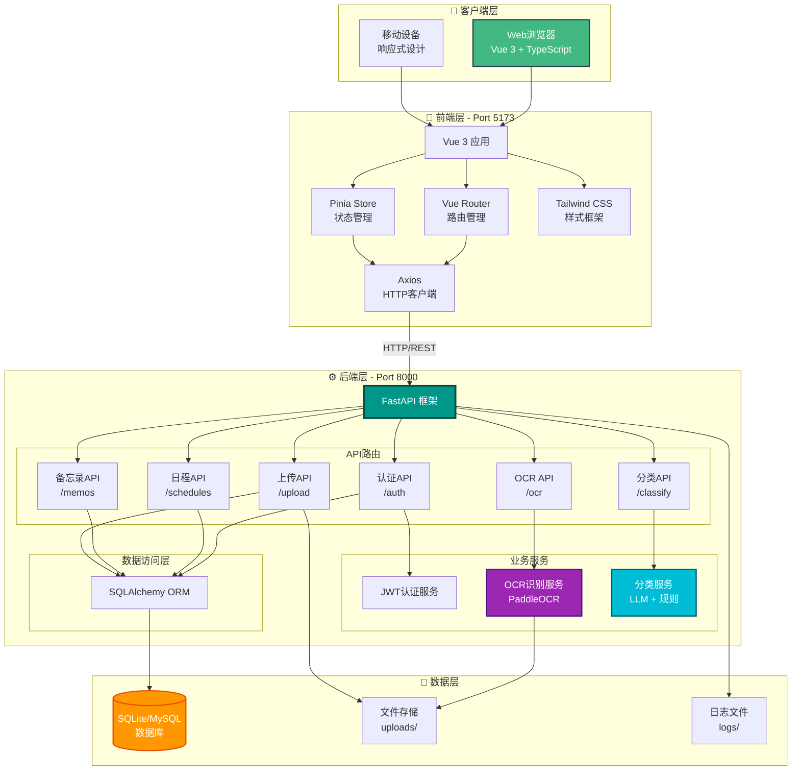

---

## 数据流向图

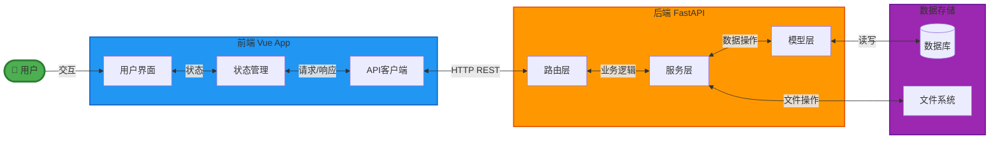

---

## 核心功能模块关系图

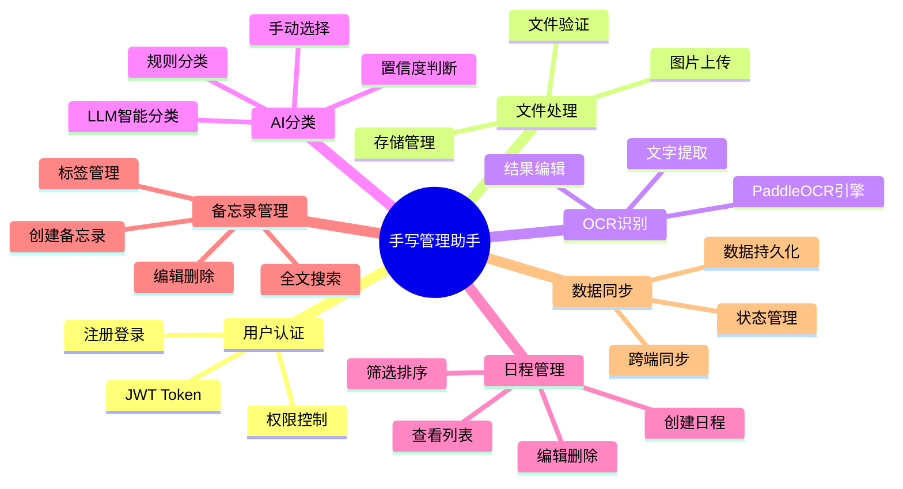

---

## 2. 用户认证流程

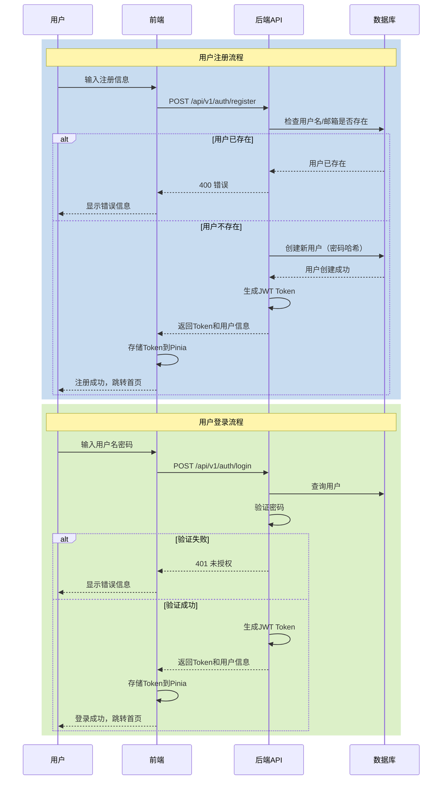

## 3. OCR识别完整流程

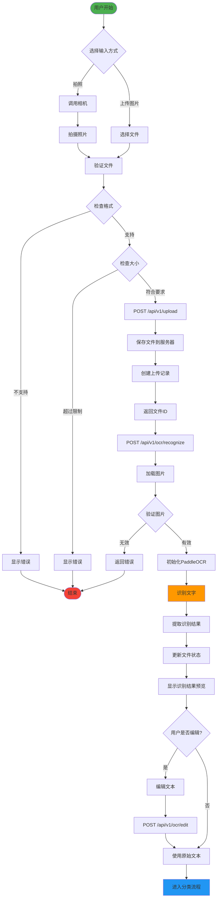

## 4. AI分类流程

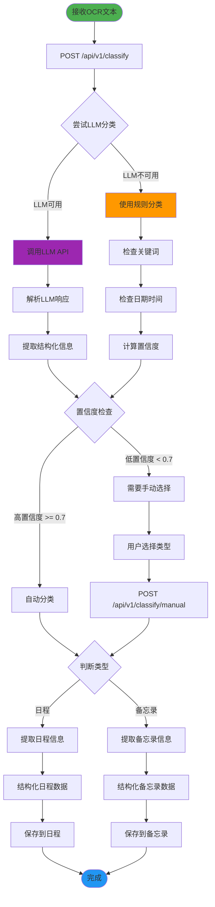

## 5. 日程管理流程

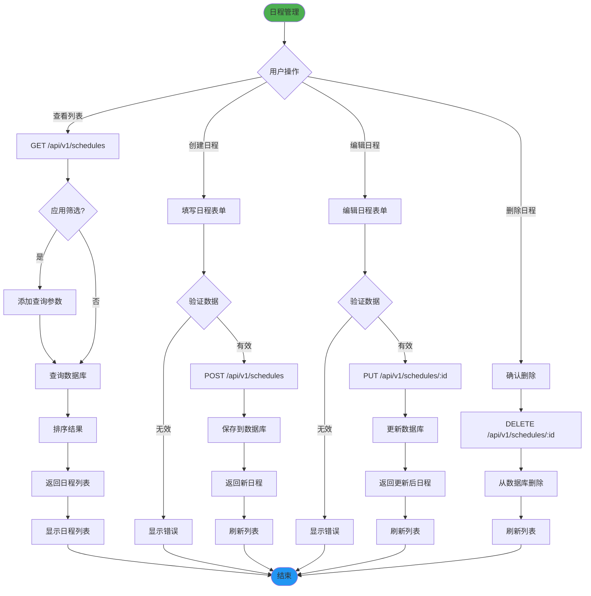

## 6. 备忘录管理流程

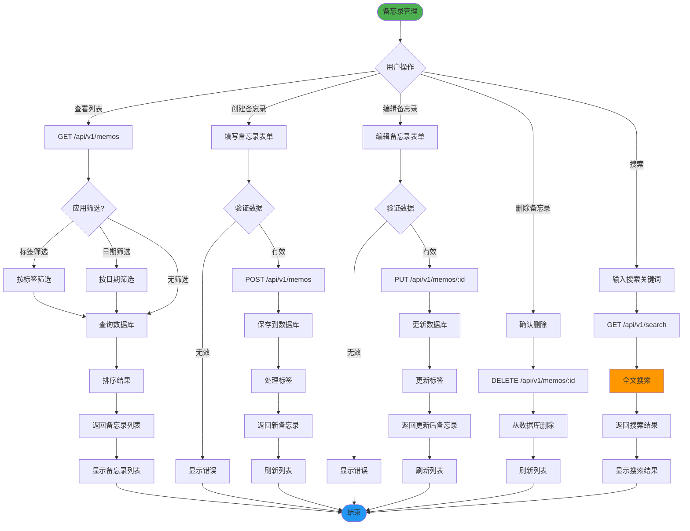

## 7. 数据模型关系图

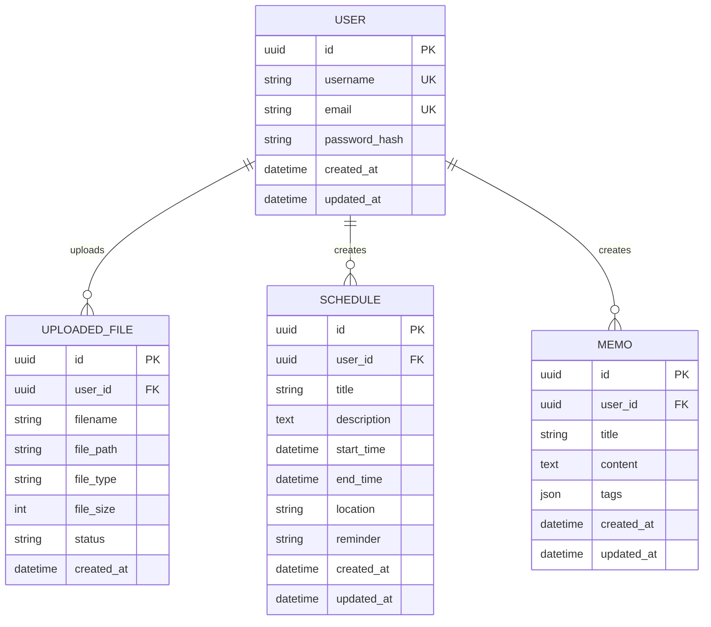

## 8. 完整业务流程图

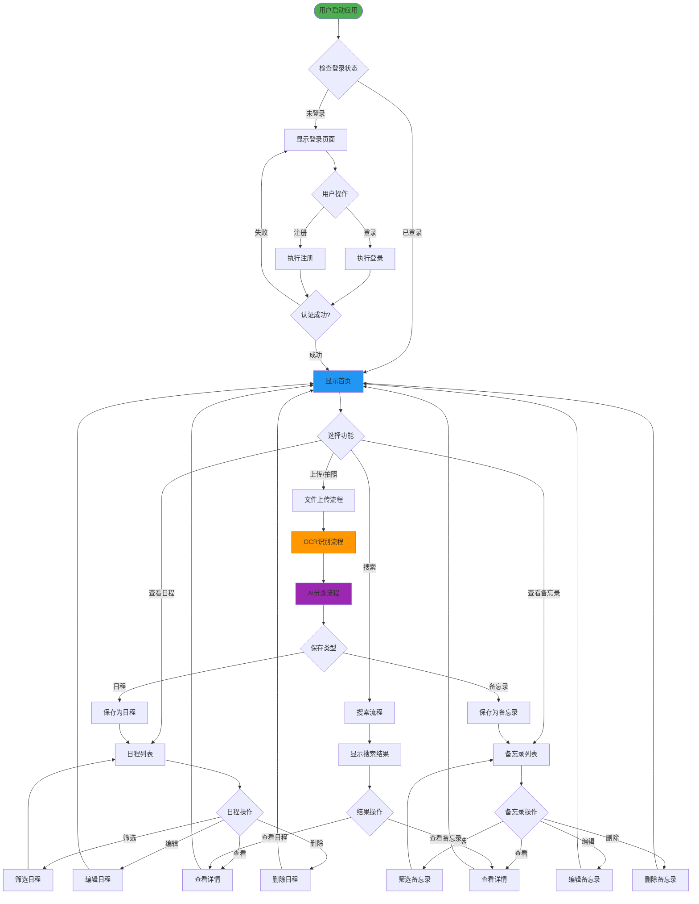

## 9. 技术栈交互图

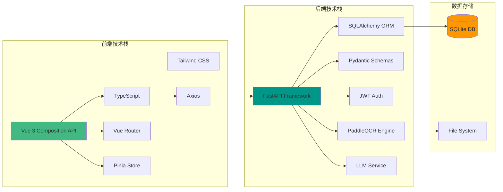

## 10. 部署架构图

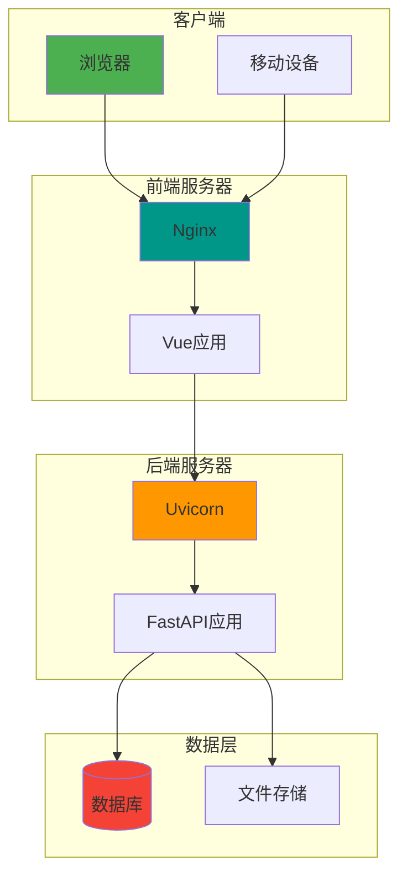

---

## 使用说明

这些流程图展示了手写管理助手项目的各个方面：

1. **系统整体架构图** - 展示前后端技术栈和数据层的关系
2. **用户认证流程** - 详细的注册和登录时序图
3. **OCR识别完整流程** - 从上传到识别的完整流程
4. **AI分类流程** - LLM和规则分类的决策流程
5. **日程管理流程** - CRUD操作的完整流程
6. **备忘录管理流程** - 包含标签和搜索的管理流程
7. **数据模型关系图** - 数据库实体关系
8. **完整业务流程图** - 用户使用应用的完整路径
9. **技术栈交互图** - 各技术组件之间的依赖关系
10. **部署架构图** - 生产环境的部署结构

你可以在支持Mermaid的Markdown查看器中查看这些图表，或者使用在线工具如 [Mermaid Live Editor](https://mermaid.live/) 来渲染和编辑这些图表。
